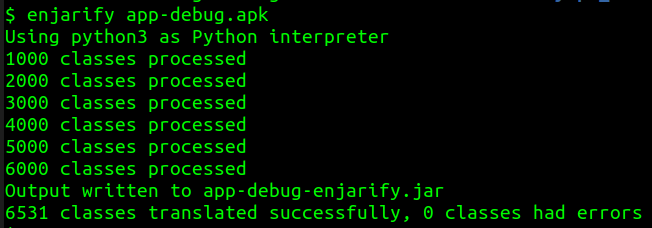
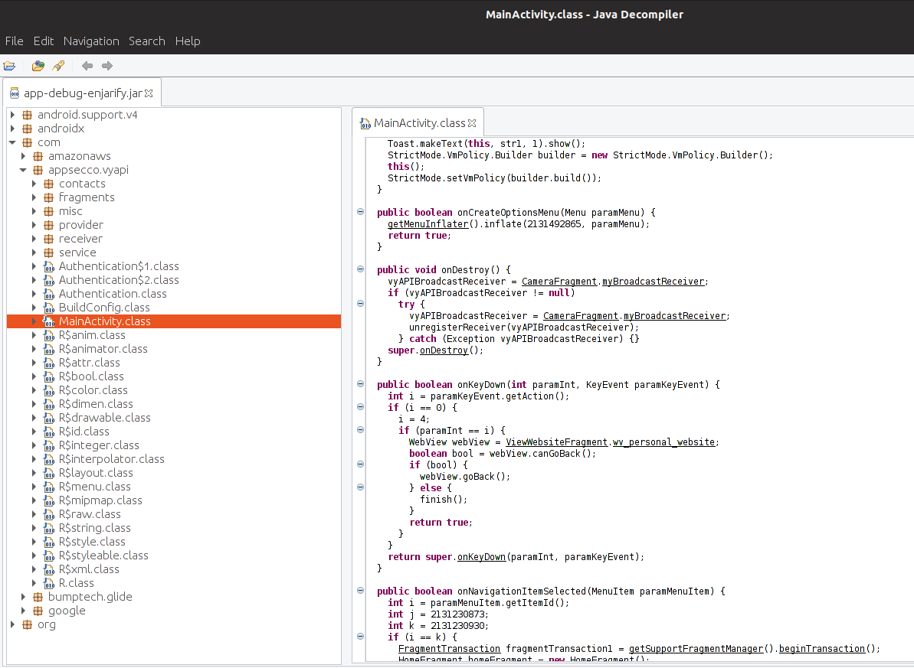
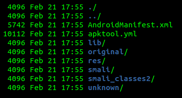
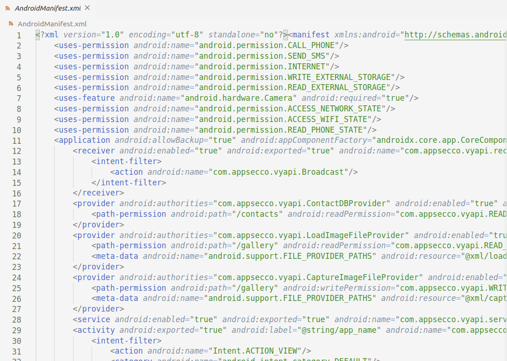

# Reverse Engineering

- [Reverse Engineering](#reverse-engineering)
  - [1. Identify the Supported Architecture](#1-identify-the-supported-architecture)
  - [2. Explore the APK Bundle](#2-explore-the-apk-bundle)
  - [3. Decode using APKTool](#3-decode-using-apktool)
    - [Decode using SMALI](#4-decode-using-smali)

## 1. Identify the Supported Architecture

1. Unzip the APK

        $ unzip app-debug.apk -d vyapi_binary

2. View the contents of `lib` folder
   
        $ ls -la vyapi_binary/lib/

    

3. If app installation is failing on an Android Virtual Device (AVD), check if the AVD supports one of the listed architectures (see step #2, above). If not, create a new AVD that supports any of the above listed architectures.

## 2. Explore the APK Bundle

1. Browse through different files and folders in the **unzipped** APK bundle. Look for interesting files.

    

2. `AndroidManifest.xml` is an interesting place to begin with. However, the file is encoded. We shall decode it shortly.
3. What else is bundled in the Android APK? 
   
> **EXERCISE-1:**
> Make a list of all interesting files and folders that you see in the unzipped APK 

## 3. Decode using APKTool

1. Convert the APK into a JAR file using **Enjarify** tool

        $ enjarify app-debug.apk

    

2. Access this JAR file using **JD-GUI** java decompiler

        $ java -jar ./jd-gui-1.6.2.jar app-debug-enjarify.jar

    

> **EXERCISE-2:**
> 1. Do you see any hardcoded secrets?
> 2. Can you understand the app structure and business logic?

3. Decode the APK using **APKTool**

        $ apktool d app-debug.apk 

    

4. Browse through different files and folders in the **decoded** APK. Look for interesting files.

    

5. `AndroidManifest.xml` is human readable now

    

> **EXERCISE-3:**
> Can you identify the attack surface by analyzing *AndroidManifest.xml* file and other class files?
>1. In the decoded APK, look for classes.dex file/s. These are the code of the APK.

>2. This .dex file can be decoded by Dex2Jar tool or BakSMALI can be used. 

>3. We will prefer BakSMALI as it is easier to change and re-compile.

### Decode using SMALI
1. Extract APK and locate classes.dex file/s.

2. Run BakSMALI to decode classes.dex file/s
    
        $ java -jar baksmali-2.3.4.jar d C:\Mohit\Personal\Null_Android\Day1\Activity_Service\Sample1\app\build\outputs\apk\release\app-release-unsigned\classes.dex

3. An folder named 'out' will be created in the terminal/command-prompt location.

[To understand about SMALI code](pending)

[Repacking the apk after a change.](../Recompiling_APK/README.md)